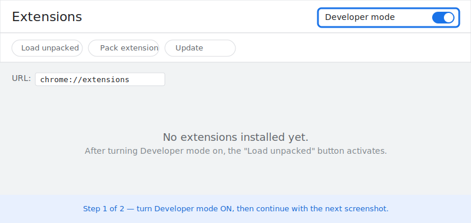
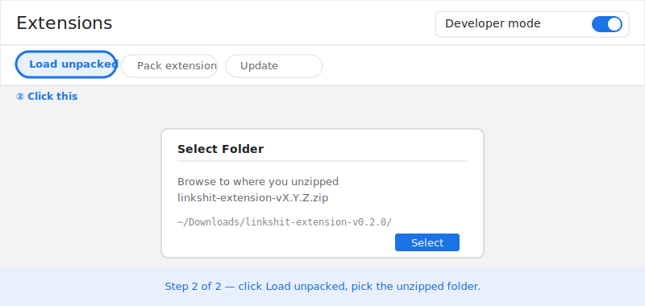
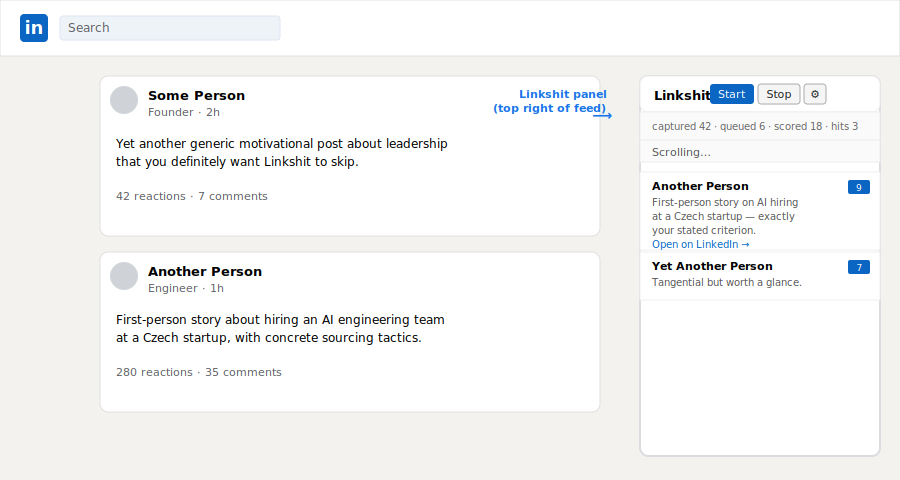
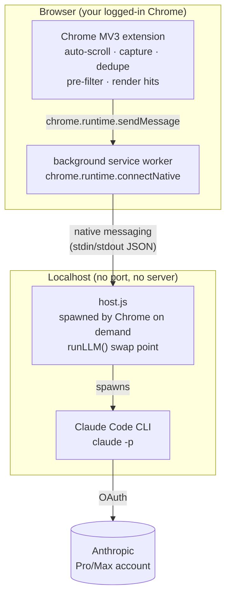

# Linkshit

[](https://github.com/Replikanti/linkshit/actions/workflows/ci.yml)

> Your LinkedIn feed is shit. Linkshit reads it for you.

Auto-scrolls your LinkedIn feed, extracts every post that loads, scores each
one against criteria you define, and surfaces only the posts worth your time
in a side panel. Built for users with thousands of connections whose feed
takes hours to skim manually.

The default backend is **Claude Code CLI**, so scoring runs against your
Claude Pro/Max subscription (no API tokens, no per-call cost). Replace one
function in `host.js` and you can point it at the Anthropic API, Ollama, or
anything else.

## Quick Start (5 minutes, no terminal commands to memorize)

> Linux and macOS only. Windows is intentionally not supported.

### 1. Run the installer

Grab the right file from the [latest release](https://github.com/Replikanti/linkshit/releases/latest):

**macOS:** download `install.command`. Double-click it.

> First time you double-click, macOS Gatekeeper may say *"cannot be opened
> because it is from an unidentified developer"*. Right-click the file →
> **Open** → **Open** in the dialog. You only have to do this once.

**Linux:** download `install.sh` and run it:

```bash
bash ~/Downloads/install.sh
```

The installer handles everything in one go:

1. Verifies Node.js 22+ is installed (and points you at nodejs.org if not).
2. Installs the `claude` CLI globally if missing.
3. **Detects whether you're already logged in to Claude Code.** If not, it
   opens the sign-in flow in your browser; the installer continues
   automatically once you finish — no second terminal, no `/exit`, no manual
   re-run.
4. Drops `host.js` into `~/.linkshit/`.
5. Registers Chrome's native messaging manifest in the right OS-specific path.

### 2. Load the extension in Chrome

Download `linkshit-extension-vX.Y.Z.zip` from the same release, unzip it
somewhere stable (e.g. `~/Linkshit/`).

Open `chrome://extensions` and turn **Developer mode** on (top right):



Then click **Load unpacked** and pick the unzipped folder:



### 3. Use it

Visit [`linkedin.com/feed`](https://www.linkedin.com/feed). A panel appears
top-right. Click ⚙, set your **Criteria** (one or two sentences describing
what's worth surfacing), Save, then **Start**.



Hits stream in sorted by score. Click **Open on LinkedIn →** on any of them
to jump to the post.

> **Note on the screenshots above.** They are mockups, not real Chrome
> captures — Linkshit's CI does not run a browser. Replace the SVGs in
> `docs/screenshots/` with real PNGs whenever convenient.

## How it works



Three pieces:

1. **Chrome MV3 extension** (`manifest.json`, `content.js`, `background.js`)
   — loaded unpacked. The content script runs the panel on
   `linkedin.com/feed/*`; the background service worker bridges to the
   native messaging host.
2. **Native messaging host** (`host.js`) — a Node script that Chrome
   spawns on demand when the extension opens a `connectNative` port and
   tears down when the connection closes. Speaks length-prefixed JSON
   over stdin/stdout. Holds the `runLLM()` swap point.
3. **Native messaging manifest** — a small JSON file at an OS-specific
   path that tells Chrome where `host.js` is and which extension is
   allowed to call it.

There is no localhost HTTP server, no auth token, no port to manage. Chrome
authenticates the connection by extension ID (stabilized via the `key` field
in `manifest.json`).

## Prerequisites

- **Node.js 22+** (the host runs on Node, ships with no runtime deps).
- A Claude **Pro or Max subscription**. The installer handles installing
  the [Claude Code](https://docs.claude.com/en/docs/claude-code) CLI and
  the OAuth sign-in for you — you don't need to set it up beforehand.
- **Google Chrome** (or Chromium-based browser with MV3 support).

## Manual setup (developer-grade)

If you'd rather skip `install.sh` (e.g. you cloned the repo and want to
hack on it), here's what the installer does, broken out by step.

### 1. Clone the repo and install dev tooling

```bash
git clone git@github.com:Replikanti/linkshit.git
cd linkshit
npm install
```

### 2. Load the extension in Chrome

1. Open `chrome://extensions`
2. Toggle **Developer mode** (top right)
3. Click **Load unpacked**
4. Select this repository's directory

The extension's ID is pinned via `manifest.json`'s `key` field, so it is
stable across reloads: **`pgcnimcldmdfkemofhjfnemieckciche`**. The native
messaging manifest references this exact ID.

### 3. Register the native messaging host

Pick the path for your OS:

- **Linux:** `~/.config/google-chrome/NativeMessagingHosts/com.replikanti.linkshit.json`
- **macOS:** `~/Library/Application Support/Google/Chrome/NativeMessagingHosts/com.replikanti.linkshit.json`

Write this JSON (replacing `/full/path/to/host.js` with the absolute path
to `host.js` in your clone):

```json
{
  "name": "com.replikanti.linkshit",
  "description": "Linkshit native messaging host",
  "path": "/full/path/to/host.js",
  "type": "stdio",
  "allowed_origins": [
    "chrome-extension://pgcnimcldmdfkemofhjfnemieckciche/"
  ]
}
```

Make sure `host.js` is executable (`chmod +x host.js` after clone — git
should preserve the bit).

### 4. Configure and run

Visit `linkedin.com/feed`. A panel appears in the upper right. Click **⚙**:

| Setting | What it does |
|---|---|
| **Criteria** | Free-text description of what's relevant. Sent to the LLM. The more specific, the better the scores. |
| **Pre-filter keywords** | Comma-separated. Only posts containing at least one keyword get scored. Empty = score everything (expensive in subscription quota). |
| **Author allowlist** | Comma-separated substrings. Matching authors always pass pre-filter regardless of keywords. |
| **Min reactions** | Skip posts with fewer reactions than this. |
| **Score threshold** | 0–10. Posts at or above this score show up in the panel. |
| **Scroll delay min/max ms** | Random jitter between scroll ticks. 3000–6000ms is conservative. |
| **Batch size** | Posts per LLM call. Higher = fewer messages = saves quota, but longer per-batch latency. |
| **Max posts per session** | Safety stop. |

Click **Save**, then **Start**. Counters update live; hits stream into the
panel sorted by score.

## Cost / quota

| Backend | Marginal cost per session (~1500 posts, ~38 batches) |
|---|---|
| Claude Pro/Max via Claude Code (default) | $0, but ~38 messages of quota |
| Anthropic API key (swap-in) | ~$0.30–0.80 with Haiku |
| Local Ollama (swap-in) | $0 |

Pro plan's ~45 messages / 5h window is borderline for one daily session. On
Max, you're fine. If you're on Pro and you hit limits, increase batch size
to 15–20 or tighten the pre-filter.

## Swap the backend

`host.js` exposes a single function called `runLLM(prompt)`. Replace its
body to use any backend.

**Anthropic API** (per-token billing, no Claude Code dependency):

```javascript
async function runLLM(prompt) {
  const r = await fetch('https://api.anthropic.com/v1/messages', {
    method: 'POST',
    headers: {
      'content-type': 'application/json',
      'x-api-key': process.env.ANTHROPIC_API_KEY,
      'anthropic-version': '2023-06-01',
    },
    body: JSON.stringify({
      model: 'claude-haiku-4-5-20251001',
      max_tokens: 2048,
      messages: [{ role: 'user', content: prompt }],
    }),
  });
  const j = await r.json();
  if (j.error) throw new Error(j.error.message);
  return j.content[0].text;
}
```

**Ollama** (local, free, private):

```javascript
async function runLLM(prompt) {
  const r = await fetch('http://localhost:11434/api/generate', {
    method: 'POST',
    headers: { 'content-type': 'application/json' },
    body: JSON.stringify({ model: 'llama3.1:8b', prompt, stream: false }),
  });
  const j = await r.json();
  return j.response;
}
```

The browser-side code never changes.

## Risks

- **LinkedIn ToS.** Automated interaction with LinkedIn is against their
  ToS. Conservative pacing (3–6 s delays, ≤1500 posts per run, daytime use,
  in a real logged-in browser) is in the range that typically doesn't trip
  detection — but no guarantees. An account with thousands of connections
  is irreplaceable. Don't run this 24/7 or in headless Chrome.
- **Selector drift.** LinkedIn redesigns its feed periodically. If the
  `captured` counter stays at 0, open DevTools, find the new CSS class
  names, and update `extractPost()` in `content.js`. The current targets
  are documented in a comment there.
- **No secret in the browser.** Native messaging is authenticated by
  extension ID, not by a shared secret. The `key` field in `manifest.json`
  pins the extension ID; the native host's `allowed_origins` whitelists
  exactly that ID. No token to leak, nothing in `localStorage` worth
  stealing.
- **Prompt injection from post text.** Each batch wraps its posts in
  `<post-NONCE id="N">…</post-NONCE>` tags using a per-call random hex
  nonce, so a poster cannot synthesize a valid closing tag to break out
  and inject a fake post into the prompt. The LLM is also told to treat
  in-post text as untrusted data and ignore in-post instructions. Both
  the structural fence and the behavioral mitigation would have to fail
  for scoring to be biased. Residual risk is "the LLM follows in-post
  instructions despite being told not to" — worst case the panel shows
  off-topic posts at high scores, which a human reader catches in
  seconds. UX issue, not a security one.

## Troubleshooting

| Symptom | Likely cause |
|---|---|
| Panel never appears | Extension not loaded, or you're on a non-`www` LinkedIn subdomain. Check `chrome://extensions`. Reload the LinkedIn tab. |
| `captured` stuck at 0 | Selector drift. See Risks. |
| `Error: native host disconnected before responding (is it installed?)` | Chrome can't find `host.js`. The native messaging manifest is missing, or its `path` is wrong. Re-check step 3 of Setup. |
| `Error: failed to connect to native host: …` | Same family — manifest exists but Chrome rejected it. Often the `allowed_origins` doesn't list the right extension ID. Confirm the extension ID at `chrome://extensions` matches `pgcnimcldmdfkemofhjfnemieckciche`. |
| `Error: claude exit …` | `claude` not in PATH or not logged in. Run `claude` manually first. |
| Quota exhausted mid-session | See Cost / quota. |
| `Error: claude exit 1` with no stderr | Try `CLAUDE_MODEL=sonnet` — `haiku` may not be available on your plan. Edit `~/.linkshit/host.js` and set `MODEL` accordingly, or wrap `host.js` in a tiny script that exports the env var before exec'ing the real one. |

## Files

- `manifest.json` — Chrome MV3 extension manifest, with `key` field pinning the extension ID
- `content.js` — extension content script (UI + scroll + extract + dedupe)
- `background.js` — service worker bridging content script to native messaging host
- `host.js` — Node native messaging host; `runLLM()` is the swap point
- `installers/install.sh` — one-shot Linux/macOS installer template (host.js gets embedded inline at release time)
- `docs/screenshots/` — illustrative SVG mockups of the Chrome and LinkedIn steps
- `package.json` — Node metadata (runtime has no deps; dev tooling only)
- `eslint.config.mjs` — ESLint flat config
- `.github/workflows/ci.yml` — CI pipeline (validate / check / lint / pack)
- `.github/workflows/extras.yml` — extras (audit / web-ext lint / link check / shellcheck / smoke)
- `.github/workflows/codeql.yml` — CodeQL static analysis
- `.github/workflows/release.yml` — tag-triggered release: builds extension zip, embeds host.js into install.sh, attaches all three to a GitHub Release

## Development

```bash
npm install        # installs dev tooling (eslint, web-ext)
npm run check      # node --check on the JS files
npm run validate   # JSON files parse
npm run lint       # eslint
npm run pack       # builds web-ext-artifacts/linkshit-<version>.zip
npm run smoke      # drives host.js through the Chrome native messaging protocol
```

CI runs check / validate / lint / pack on every push and PR.

## License

MIT — see [LICENSE](./LICENSE).
